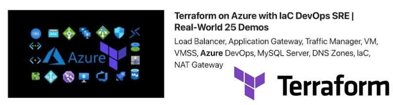

# Terraform on Azure with IaC DevOps and SRE | Real-World 25 Demos

## Course Modules
01. Infrastructure-as-Code-IaC-Basics
02. Install-Tools-TerraformCLI-AzureCLI-VSCodeIDE
03-Terraform-Command-Basics
04-Terraform-Language-Syntax
05-Terraform-Provider-Resource-Block-Basics
06-Azure-Terraform-VsCode-Plugin
07-Multiple-Provider-Configurations
08-Providers-Dependency-Lock-File
09-Resource-Syntax-and-Behavior
10-Azure-Virtual-Network-4Tier
11-Azure-Linux-Virtual-Machine
12-Azure-Bastion-Service-and-Host
13-Azure-Standard-LoadBalancer-Basic
14-Azure-Standard-LoadBalancer-Inbound-NATRules
15-Azure-SLB-VM-with-MetaArgument-Count
16-Azure-SLB-VM-with-for-each-and-for-loops
17-Azure-VM-ScaleSets-Manual-scaling
18-Azure-VM-ScaleSets-Auto-scaling
19-Azure-External-and-Internal-LB-with-VMSS
20-Azure-Private-DNS-Zones
21-Delegate-DNS-Domain-to-Azure-DNS
22-Azure-Public-DNS-Zone
23-Azure-Terraform-Remote-State-Storage
24-Azure-Traffic-Manager
25-Azure-Application-Gateway-using-Portal
26-Azure-Application-Gateway-Basics
27-Azure-Application-Gateway-Path-Based-Routing
28-Azure-Application-Gateway-Multisite-Hosting
29-Azure-Application-Gateway-SSL-SelfSigned
30-Azure-Application-Gateway-SSL-SelfSigned-KeyVault
31-Azure-IaC-DevOps
32-Azure-MySQL-Single-Server
33-Terraform-Modules-use-Public-Module
34-Terraform-Azure-Static-Website
35-Terraform-Modules-Build-Local-Module
36-Terraform-Module-Publish-to-Public-Registry
37-Terraform-Module-Sources
38-course-presentation
